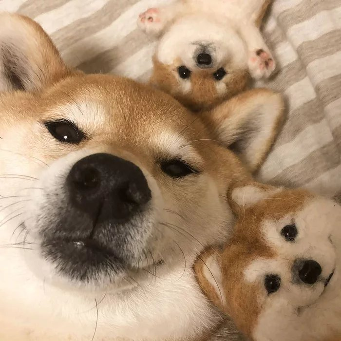
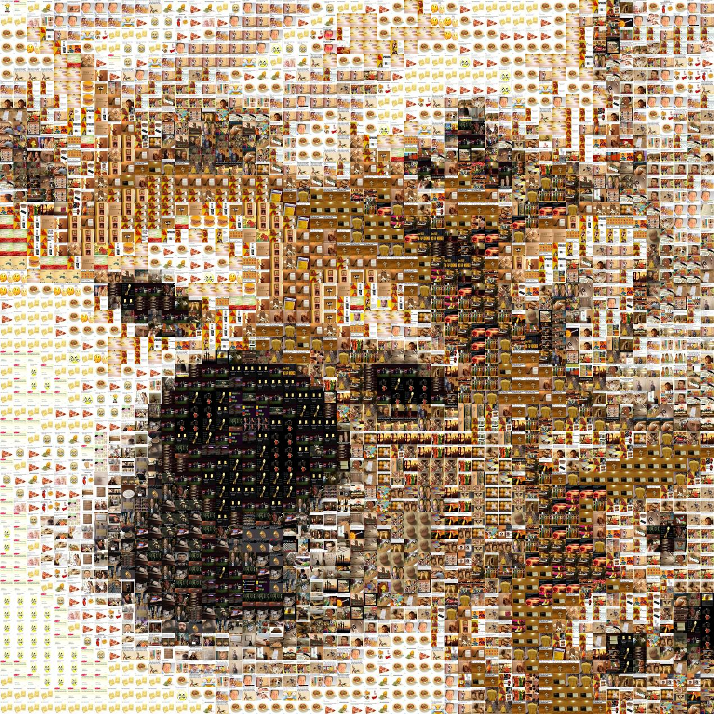
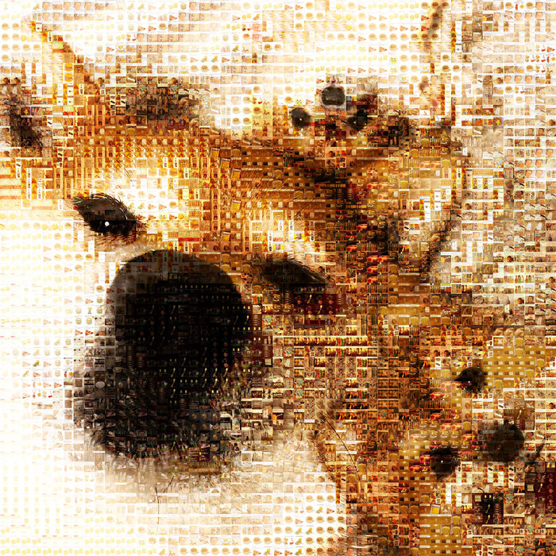
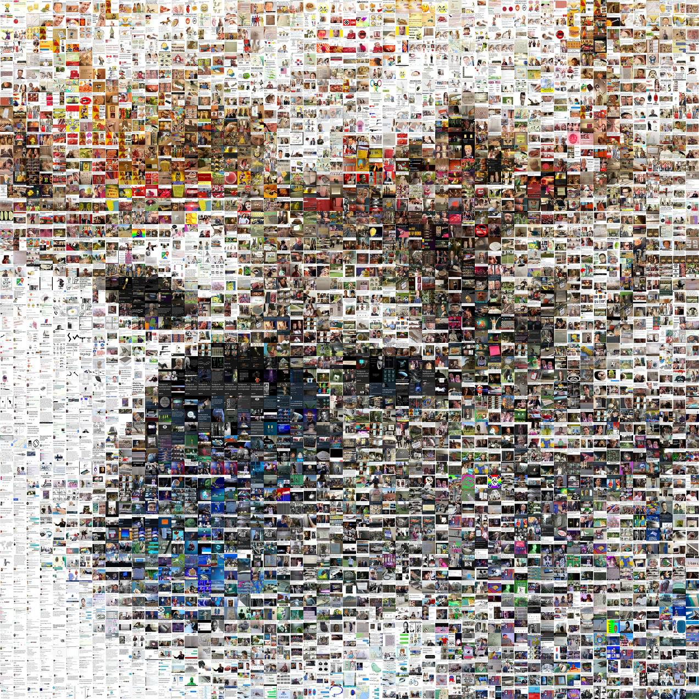
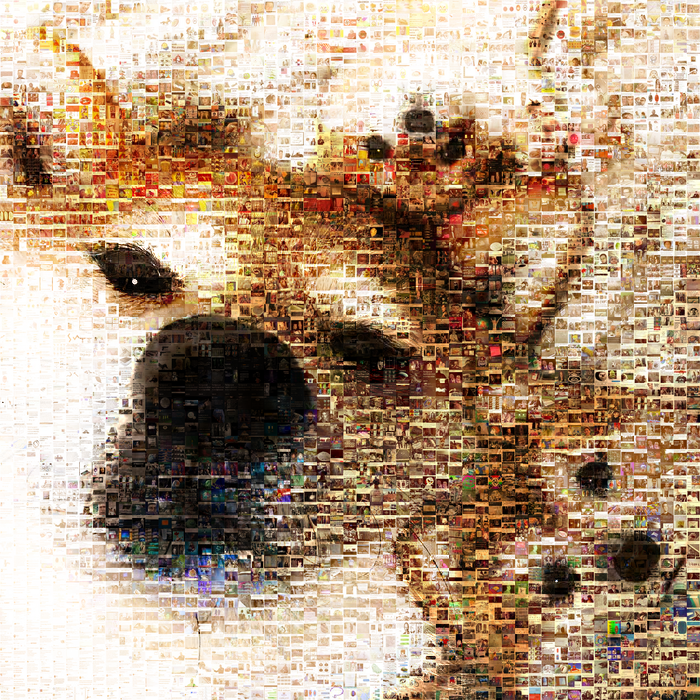
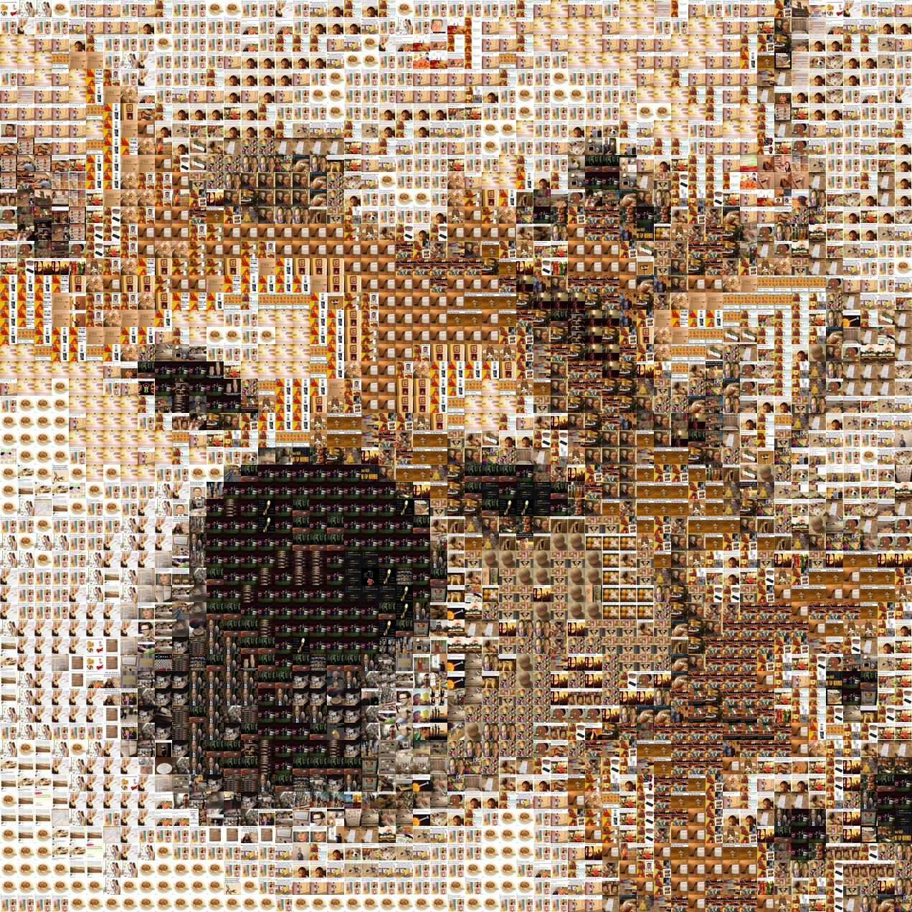
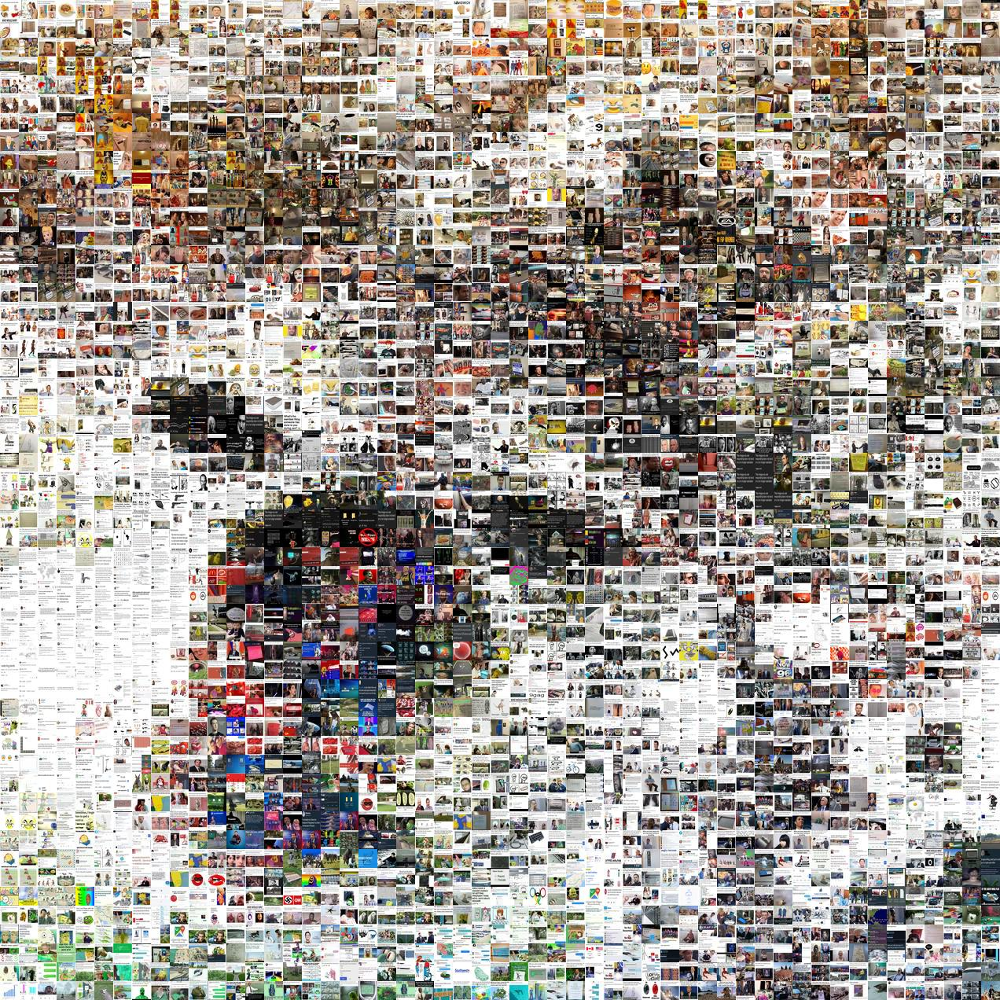
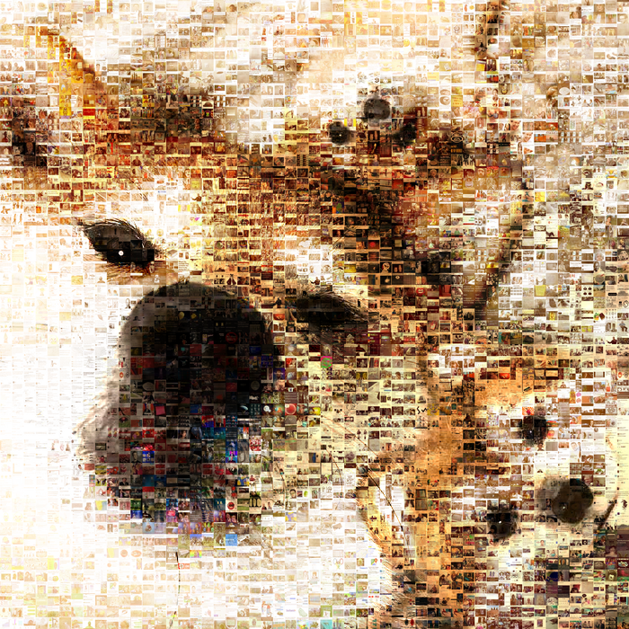

# Python-Photomosaic
This is a python script that can produce a photomosaic by dividing the photo into a number of slices than replacing them with your tiles using euclidian math or cielab space for finding the closest match of colors.
### Prerequisites
image_slicer, pandas, numpy, colormath, cv2
```
pip install image_slicer pandas numpy colormath opencv-python
```
## How to use
1. put the photo you want to make the mosaic out of in the same folder as the 2 .py files
2. make a folder with the photos you want to use as part of the mosaic (> 3000 photos for a better result) in the same folder as step 1
3. navigate in cmd to the folder with the 2 .py files in it
4. run the createMosaic.py with the following arguments: photo.jpg number_of_slices folder_of_tiles 1-4* 0-1**

\* 1 for Euclidean distance with repetition of tiles (fast, ok results)

\* 2 for Euclidean distance without repetition of tiles (fast, ok result)

\* 3 for cielab distance with repetition of tiles (slow, best result)

\* 4 for cielab distance without repetition of tiles (slow, best result)

** 1 will make the normal mosaic and one with the normal picture as an overlay

** 0 will not make the overlay  
Example:
```
python createMosaic.py Photo.jpg 3000 folder_of_tiles 2 1
```
If you want to subdivide the picture more or less or if you want to change it altogether you will need to delete the resized and slices folders and the dataResized.csv and dataSlices.csv files

## Example
The photo I want to make a mosaic out of is a photo of Shibes ... because Shibes. The tiles are memes from this meme dataset (https://www.kaggle.com/sayangoswami/reddit-memes-dataset).

The photo is 700 x 700 pixels and will be divided into 3000 slices. The dataset has 3326 tiles (here memes) so it should not repeat them if not specified.



#### Euclidean algorithm with repetition and overlay (14s)
```
python createMosaic.py Normal.jpg 3000 reddit-memes-datase\memes 1 1
```



#### Euclidean algorithm without repetition and overlay (14s)
```
python createMosaic.py Normal.jpg 3000 reddit-memes-datase\memes 2 1
```



#### CIELAB algorithm with repetition and overlay (22 min 14s)
```
python createMosaic.py Normal.jpg 3000 reddit-memes-datase\memes 3 1
```



#### CIELAB algorithm without repetition and overlay (22 min 14s)
```
python createMosaic.py Normal.jpg 3000 reddit-memes-datase\memes 4 1
```


